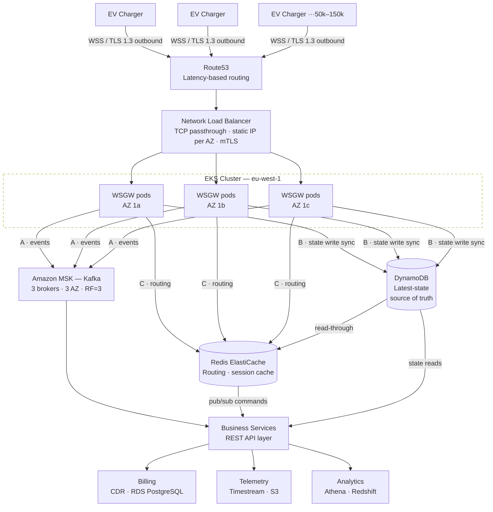
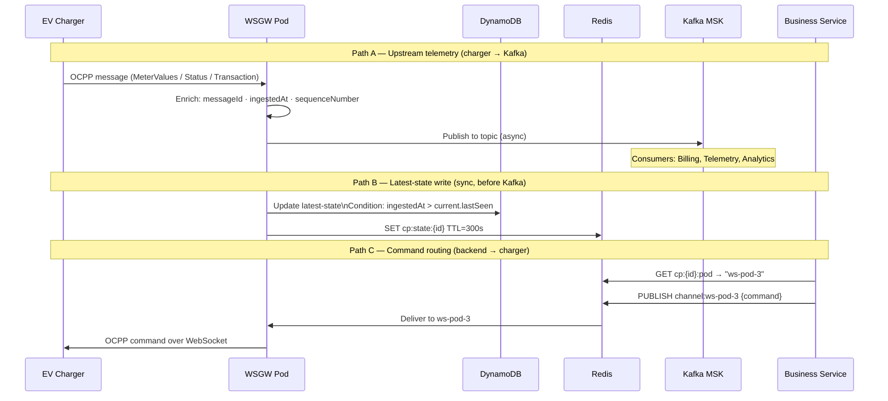
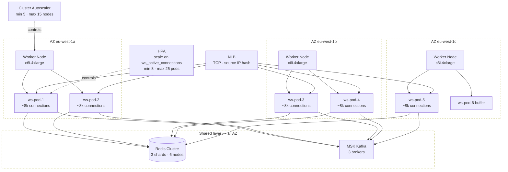
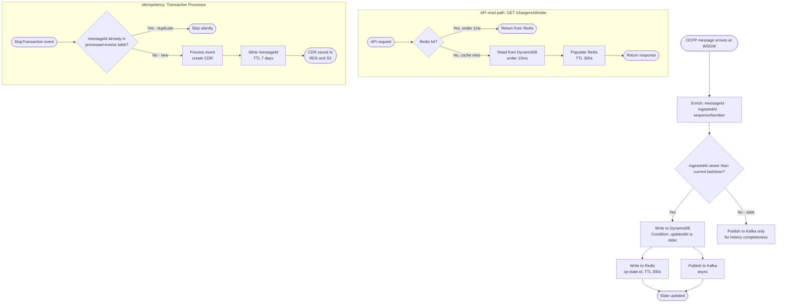

# OCPP Platform — Architecture Diagrams

> All diagrams use [Mermaid](https://mermaid.js.org/) and render automatically in GitHub.

---

## 1. High-Level Architecture

---

## 2. Data Flow — Three Independent Paths

---

## 3. WSGW — K8s Topology (Multi-AZ)

---

## 4. Latest-State — Write & Read Path

---

## How to use in GitHub

Paste any diagram block directly into a `.md` file:

~~~markdown

~~~

GitHub renders it automatically — no plugins or extensions needed.
